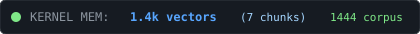
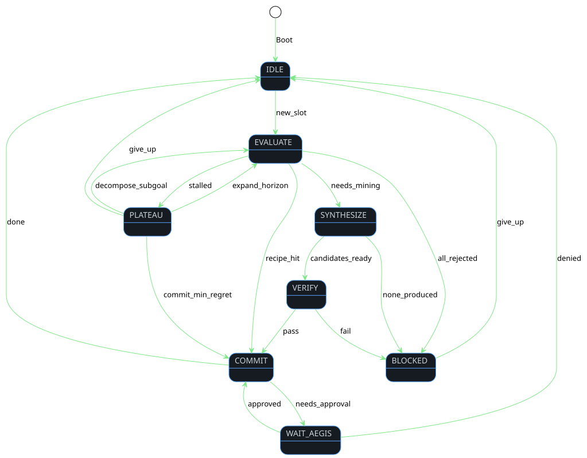
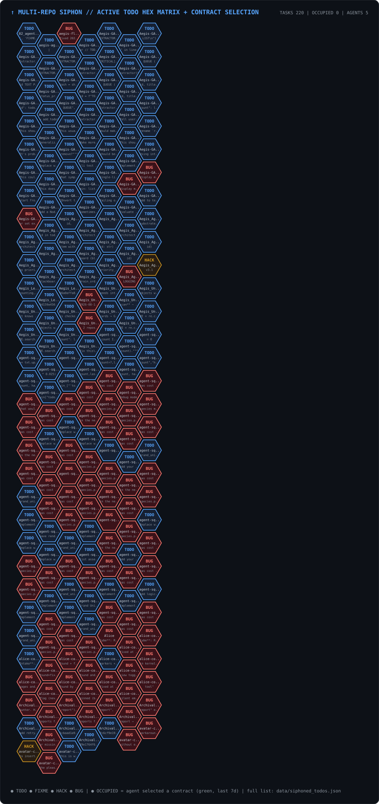
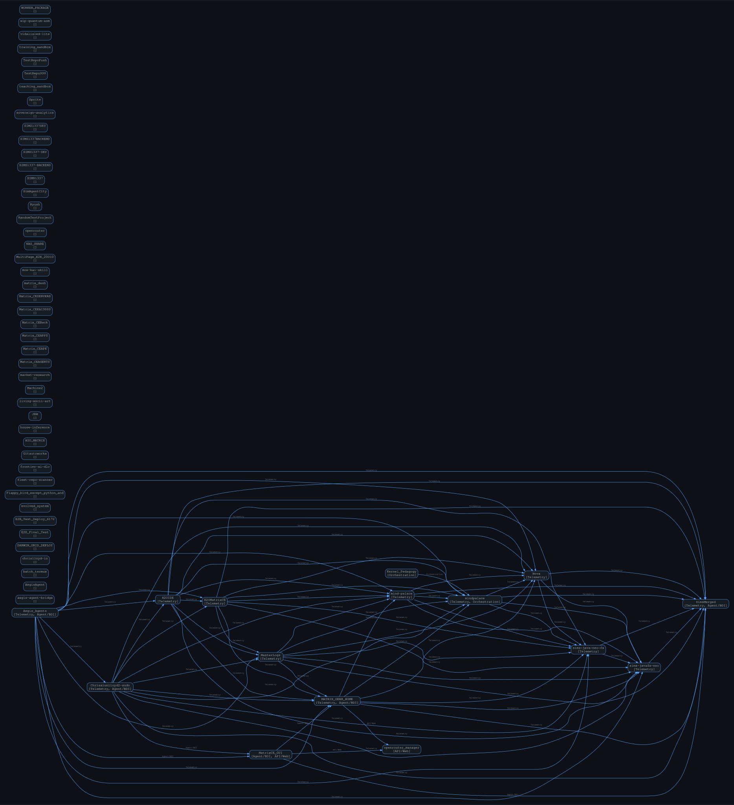
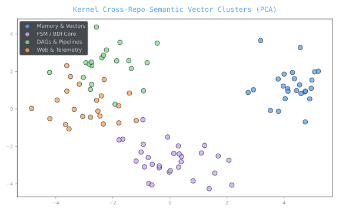

  

    

  

    

  

    

  

---

### 🧬 Dynamic Contribution Stream
<picture>
  <source media="(prefers-color-scheme: dark)" srcset="https://raw.githubusercontent.com/Chrisalunlloyd2-sudo/Chrisalunlloyd2-sudo/output/github-snake-dark.svg" />
  <source media="(prefers-color-scheme: light)" srcset="https://raw.githubusercontent.com/Chrisalunlloyd2-sudo/Chrisalunlloyd2-sudo/output/github-snake.svg" />
  
</picture>

---

### 🖥️ Live Portfolio

  

---

### 🧠 Kernel — Live Agent Telemetry

  
    
  
    
  
    
  
    
  

---

### ⬡ Multi-Repo TODO Hex Matrix

  

---

### 🌐 Cross-Repo Unified Graph & Next Steps

  

See [SYNTHESIS_PLAN.md](SYNTHESIS_PLAN.md) for the live auto-correlated task queue.

---

### 🌌 Codebase Semantic Vector Clusters

  

---

### ⚡ Active System Core
- 🛰️ **Automation:** Daily autonomous mirrors & continuous state captures
- 🧬 **Stack:** BDI-FSM agent, Sophia logic, Enigma rotor codecs, HDC vector memory
- 🤖 **Kernel:** deterministic zero-LLM coding agent — 672 tests green, law-gated promotes, Nash theta* act-gates
- 📡 **Telemetry:** 13 GitHub Actions keep every SVG live — hex TODO siphon, cross-repo synthesis, BDI HUD, FSM heatmap
